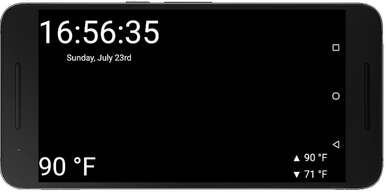

# smart-mirror_small
## A simple react-native powered app to make use of any old phone in a smart mirror.

**What is a smart mirror?** Check out an example here: [“My Bathroom Mirror Is Smarter Than Yours” by @maxbraun](https://medium.com/@maxbraun/my-bathroom-mirror-is-smarter-than-yours-94b21c6671ba)

This app provides an alternative to other smart mirrors which use a monitor and Raspberry Pi. All you need is that old android or iPhone collecting dust in your desk!

The **time** and **date** along with a basic **weather forecast** are displayed.

The present, high, and low temperatures are provided by the OpenWeatherMap API. Future versions should display the current and/or forecasted weather condition (sunny, rain, snow, etc) alongside a relevant icon.

If you build the project yourself, you will need to change the zip code in the API call. In the app's current version, the location is hardcoded in. A future version will use the devices location.

Please inform me of any issues if you try it out. I have not been able to test on Iphone.
